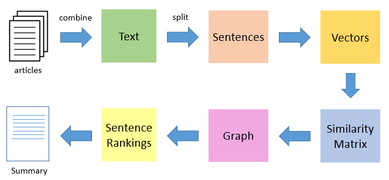

# Text summarization via an extractive approach

> This code is an impelentation of textrank algorithm for a text summarization. The algorithm is tested on english text. The code is espired by the work of "Prateek Joshi". you can find more details in the link : [orginal article](https://medium.com/analytics-vidhya/an-introduction-to-text-summarization-using-the-textrank-algorithm-with-python-implementation-2370c39d0c60)

All algorithm's steps are explained by following figure:




## Getting Started

These instructions will get you a copy of the project up and running on your local machine for development and testing purposes. See deployment for notes on how to deploy the project on a live system.

### Prerequisites

> The easiest way to perform this Python code is by using anaconda open-source distribution tool.

You can install anaconda by following instruction in this link :
[Anaconda](https://www.anaconda.com/distribution/)

> Download GloVe Word Embeddings. GloVe word embeddings are vector representation of words

You can download models in this link [GloVe](http://nlp.stanford.edu/data/glove.6B.zip).

put the file 'glove.6B.100d.txt' in 'models' folder


## Installation

Use the terminal for the following steps.

1. Create the environment from the environment.yml file:

```sh
conda env create -f environment.yml
```
The new environment's name is "textsummary"

2. Verify that the new environment was installed correctly:

```sh
conda list
```

3. to activate the new created environment use :

```sh
conda activate textsummary
```

## Release History

* 0.0.1
    * first version - completely identical to "Prateek Joshi" work

## Road Map information

* ToDo (in progress)

## Author

Abdelkader Rhouati – [@arhouati](https://twitter.com/arhouati) – abdelkader.rhouati@gmail.com

Distributed under the MIT license. See - **[MIT license](http://opensource.org/licenses/mit-license.php)** for more information.

<!--
## Usage example

A few motivating and useful examples of how your product can be used. Spice this up with code blocks and potentially more screenshots.

_For more examples and usage, please refer to the [Wiki][wiki]._

## Development setup

Describe how to install all development dependencies and how to run an automated test-suite of some kind. Potentially do this for multiple platforms.

```sh
make install
npm test
```

## Contributing

1. Fork it (<https://github.com/yourname/yourproject/fork>)
2. Create your feature branch (`git checkout -b feature/fooBar`)
3. Commit your changes (`git commit -am 'Add some fooBar'`)
4. Push to the branch (`git push origin feature/fooBar`)
5. Create a new Pull Request
-->

<!-- Markdown link & img dfn's -->

<!--
[npm-image]: https://img.shields.io/npm/v/datadog-metrics.svg?style=flat-square
[npm-url]: https://npmjs.org/package/datadog-metrics
[npm-downloads]: https://img.shields.io/npm/dm/datadog-metrics.svg?style=flat-square
[travis-image]: https://img.shields.io/travis/dbader/node-datadog-metrics/master.svg?style=flat-square
[travis-url]: https://travis-ci.org/dbader/node-datadog-metrics
[wiki]: https://github.com/yourname/yourproject/wiki
-->

<!--
**Badges will go here**

[![NPM Version][npm-image]][npm-url]
[![Build Status][travis-image]][travis-url]
[![Downloads Stats][npm-downloads]][npm-url]
[](https://travis-ci.org/badges/badgerbadgerbadger)
[](https://gemnasium.com/badges/badgerbadgerbadger)
[](https://coveralls.io/r/badges/badgerbadgerbadger)
[](https://codeclimate.com/github/badges/badgerbadgerbadger)
[](https://github.com/badges/badgerbadgerbadger/issues)
[](https://github.com/badges/badgerbadgerbadger/pulls)
[](https://rubygems.org/gems/badgerbadgerbadger)
[](http://badges.mit-license.org) [](https://github.com/badges/badgerbadgerbadger)

- For more on these wonderful ~~badgers~~ badges, refer to <a href="http://badges.github.io/badgerbadgerbadger/" target="_blank">`badgerbadgerbadger`</a>.
-->
